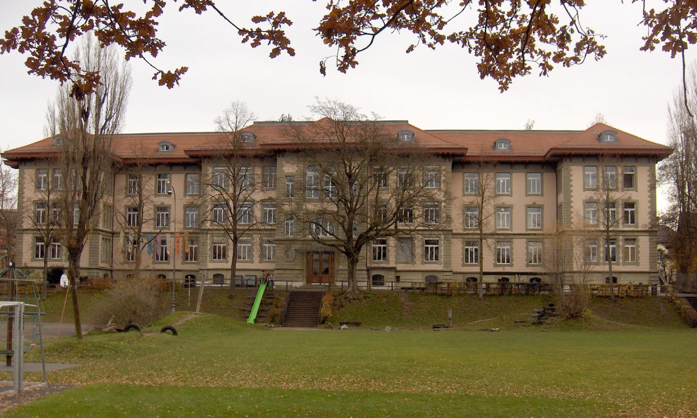
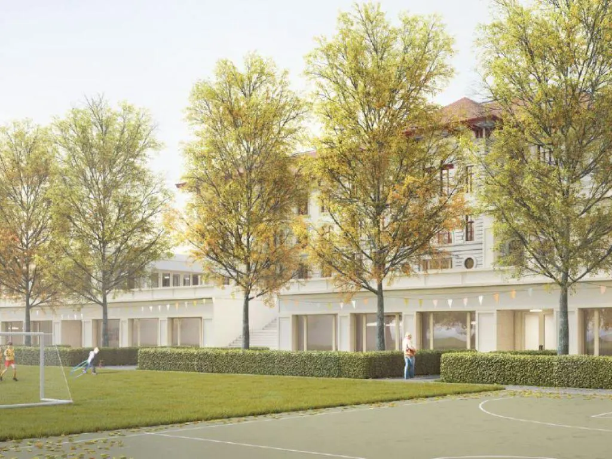

+++
title = "Die umstrittene Sanierung und Erweiterung, der Kirchenfeldprimarschule im Kirchenfeldquartier, Bern"
date = "2023-06-17"
draft = false
pinned = false
image = "microsoftteams-image-6-.png"
+++
# Die umstrittene Sanierung und Erweiterung, der Kirchenfeldprimarschule im Kirchenfeldquartier, Bern

###### *Mangelnd an Räumlichkeiten, kämpf die Kirchenfeldprimarschule gegen Asbest. Das Bauprojekt wird als Lösung umstritten währenddem das Problem von allen Aspekten ans Licht gebracht wird.* 

Wenn man in Bern über die Monbijoubrücke ins Kirchenfeldquartier fährt, passiert man unmittelbar nach der Brücke einen älteren Bau: Das Kirchenfeldschulhaus mit seiner schönen Turnhalle. Das Schulhaus stammt aus dem Jahr 1891, die Turnhalle wurde vier Jahre später ergänzt. Sie wirken gut unterhalten, der Aussenanstrich sieht frisch aus und die zwischen den beiden Gebäuden liegenden Freiflächen laden zum Fussballspielen und herumtollen ein. Man fragt sich, weshalb die Politik und die Gerichte sich seit Jahren bezüglich eines Sanierungs- und Umbauprojekts streiten.

Das Schulhaus und die Turnhalle liegen direkt an der viel befahrenen Kirchenfeldstrasse und werden von dieser nur durch ein Trottoir und einen kleinen Grünstreifen abgetrennt. Unterrichtet werden im denkmalgeschützten Gebäude Kinder der ersten bis sechste Klasse. Diese sind auf den drei Stockwerken untergebracht. Drinnen ist es kühl, dunkel und es riecht nach «Schulhaus». Kurz nach der Mittagspause riecht es auch nach Essen. Denn im Kellergeschoss ist die Tagesschule untergebracht. Da wird es über den Mittag regelmässig sehr laut und 

### Die Schülerzahlen steigen

Bereits in ihrem Bericht über die Schülerprognosen der städtischen Volksschulen Bern vom März 2010 rechnete die Stadt Bern mit einer erheblichen Zunahme der Schülerinnen und Schüler im Schulkreis Kirchenfeld-Schosshalde. Die Zunahme wurde nicht wie in anderen Schulkreisen aufgrund einer grossen Bautätigkeit begründet, sondern dadurch erklärt, dass sich die Gesellschaftsstruktur im Gebiet gewandelt haben: «Wo früher viele Betagte und Einzelpersonen wohnten, leben heute mehr Familien und Alleinerziehende mit überdurchschnittlich jungen Kindern. Weil diese gewachsene Population von Personen im Vorschulalter in unmittelbarer Zukunft eingeschult werden muss, wird dies eine (überproportionale) Zunahme der Schülerzahlen nach sich ziehen.»

Inwieweit diese Entwicklung eingetreten ist, muss an dieser Stelle offengelassen werden; die auf dem Internet verfügbaren Daten sind nicht eindeutig. Eine aktuelle Statistik der Stadt aus dem Jahr 2022 zeigt, dass im Schulkreis, im Schuljahr 18/19 in der Primarschule 1799 Schülerinnen und Schüler zwischen Kindergarten und sechsten Klasse unterrichtet wurden. Im Schuljahr 22/23 waren es 2009 Kinder, was eine Steigerung von gut 10% bedeutet. Das sind in etwa 10 zusätzlichen Klassen verteilt auf die Schulen Kirchenfeld, Laubegg und Manuel. Diese Zunahme wirkt sich auch auf die Tagesschulen aus. 

### Die Schulklassen mangeln an Räumlichkeiten

Vanessa Fiechter ist eine engagierte Lehrerin und Tagesbetreuungsleiterin an der Primarschule im Kirchenfeldquartier. Sie hat einen wichtigen Beitrag zur Bildung und Betreuung der Kinder von der Schule geleistet. Durch ihre Tätigkeit in der Tagesbetreuung gewährleistet sie eine unterstützende Umgebung für die Schülerinnen und Schüler ausserhalb des regulären Unterrichts.

Als Leiterin in der Tagesbetreuung der Primarschule ist Frau Fiechter verantwortlich für die Vermittlung von Wissen und die Entwicklung der Kinder. Sie engagiert sich dafür, dass die Schülerinnen und Schüler ihr volles Potenzial zeigen können. Sie ist sich der Bedeutung einer guten Bildung bewusst und legt großen Wert darauf, dass die Kinder intellektuell und emotional gefördert werden. Sie schafft eine positive Lernatmosphäre, in der sich die Schülerinnen und Schüler wohl fühlen.

Durch ihre Erfahrung in der Tagesbetreuung verfügt Frau Fiechter über ein tiefes Verständnis für die Bedürfnisse der Kinder außerhalb des Unterrichts. Sie ist in der Lage die individuellen Anliegen und Herausforderungen der Kinder einzugehen und den Kindern eine liebevolle Betreuung anzubieten bei dem sie helfen kann. Sie ist eine engagierte und inspirierende Persönlichkeit, die sich mit dem Wohlbefinden der Kinder einsetzt. Ihre Arbeit als Tagesbetreuerin und Lehrerin hat einen positiven Einfluss auf das Leben vieler Kinder und trägt zu einer positiven Schulgemeinschaft im Kirchenfeldquartier bei. 

Die Leiterin äussert deutliche Kritik an der aktuellen Situation bezüglich der Räumlichkeiten in der Schule. Ihrer Meinung nach spielen die Räumlichkeiten eine entscheidende Rolle im Alltag der Kinder. Es wird deutlich, dass die normalen Klassenzimmer zwar vorhanden sind, jedoch weitere verschiedene Räumlichkeiten für die Tagesbetreuung benötigt werden. 

Zudem betont Frau Fiechter die Bedeutung von Fremdsprachenzimmern für die angebotenen Kurse an der Schule. Dies verdeutlicht den Mangel an Räumlichkeiten und wirft die Frage auf, ob die derzeitigen Kapazitäten ausreichen. Die Tatsache, dass von verschiedenen Klassen mehrfach genutzte Gruppenzimmer nicht ausreichend sind, zum Beispiel beim Halbklassen Unterricht, wird von Frau Fiechter als Problem benannt. Für qualitativen Unterricht können sich keine zwei Klassen,Fachräume teilen. Es scheint, dass eine Erweiterung der Räumlichkeiten dringend erforderlich ist. 

Auch der Sportunterricht stellt für die begrenzten Räumlichkeiten ein Problem auf. Eine einzige Turnhalle reicht bei zwölf Klassen nicht aus, das führt dazu, dass auf eine kleine Turnhalle im Ka-We-De ausgewichen werden muss. Frau Fiechter unterstreicht die dringende Notwendigkeit einer Sanierung der Schule, da die Klassenzimmer in einem veralteten Zustand sind und die Wände am abbröckeln, welches keine ausreichend gute Umgebung, zur Bildung der jungen Kinder ausreicht. 

Abschliessend äussert Frau Fiechter, die Leiterin der Tagesbetreuung, den Wunsch nach einem Schulhaus, das den Anforderungen besser trifft. Sie spricht sich für ein weiteres Stockwerk aus, um die Räume offener und die Atmosphäre für die Kinder angenehmer zu gestalten. Auch zusätzliche Räume, in denen sich die Mitarbeiter zurückziehen können, sowie eine Garderobe für persönliche Gegenstände ist gewünscht. Sie stellt klar, dass die aktuellen Räume nicht ausreichend und Verbesserungen dringend notwendig sind, um den Schülerinnen und Schülern bessere Arbeitsbedingungen zu bieten.

### Bauprojekt als Lösung

Gemäss Angaben der Stadt Bern über das Bauprojekt soll mit der Sanierung und Erweiterung «zeitgemässer Schulraum für drei zusätzliche Klassen» entstehen und es sollen zwei Turnhallen gebaut werden. Nach dem Umbau würde somit Schulraum für 15 Klassen bestehen. Die Garderobenräume, die heute zu den Klassenzimmern gehören, würden zu Gruppenräumen ausgebaut. Die Tageschule, die am Mittag durchschnittlich von 44 Kindern besucht wird und maximal ca. 75 Kinder verköstigen kann, würde sich neu im Erdgeschoss befinden und Platz für 85 Kinder bieten. 

Das geplante Projekt wurde in einem Projektwettbewerb durch Fachleute und der Behörde ausgewählt. Die Gewinner des Wettbewerbes und damit auch die Planer des Projektes sind De Geeter Architekten. Da es aufgrund der aktuellen Baugesetze nicht möglich ist, den erweiterten Schulraum oberirdisch zu ergänzen und gleichzeitig die Turnhalle so wie sie ist, stehen zu lassen, soll vor allem unterirdisch gebaut werden. Das würde ermöglichen, dass wertvolle Freiflächen im Quartier Kirchenfeld bestehen bleiben. 

Während der Bauphase war geplant, dass die Basisstufen in das Kirchgemeindehaus Calvin an der Marienstrasse verlagert werden. Die anderen Klassen sollten im grossen Mattenschulhaus weiter unterrichtet werden. Diese Möglichkeiten sind teilweise heute nicht mehr gegeben, so wird das Calvinhaus aktuell abgerissen. Im Neubau sind Büros und Wohnungen vorgesehen.

### Widerstand gegen die Sanierung

Im Jahr 2016 haben die Stimmberechtigten der Stadt Bern einen Baukredit von fast 46 Millionen Franken für den Umbau und die Erweiterung des Schulhauses bewilligt und dies mit einer guten Mehrheit von über 70% Ja-Stimmen. Baustart sollte im Jahr 2017 sein. Das Bauprojekt ist seither aber blockiert, dies aufgrund von Beschwerden gegen die notwendige Änderung des Zonenplans. Diese wurden mehrheitlich von Nachbarn erhoben. Zudem wurde bereits von Beginn an Kritik am Bauprojekt geäussert. Kritisch ist vor allem der SVP-Politiker Alexander Feuz, der in der Nähe des Schulhauses wohnt. Die Kritik wird aber auch von der Co-Präsidentin des Kirchenfeld-, Brunnadern-, Elfenau-Leists unterstützt. Sie bemängelt dabei die hohen Kosten und ist der Meinung das Projekt sei überdimensioniert. Zudem würde der «Neubau» zu stark ins Ortsbild eingreifen. Sie fände eine In-Haus-Erweiterung des Schulhauses und der bestehenden Turnhalle die bessere Alternative.

Dass das Bauprojekt immer noch gestoppt ist, ist aber nicht «nur» wegen den von Frau Fiechter geschilderten Umstände schwierig. Schon kurz vor der Abstimmung musste die Turnhalle des Schulhauses wegen Asbestgefahr geschlossen werden. Dank Sofortmassnahmen war es möglich die Turnhalle wieder zu öffnen. Asbest wurde aber auch in weiteren Räumen gefunden.

> #### *«Die unsichtbare Gefahr»*
>
> *Einst als "Wundermineral" gefeiert, entpuppt sich Asbest heute als tödliche Gesundheitsgefahr. In vielen älteren Gebäuden lauert Asbest unbemerkt, versteckt in Bauelementen wie Dachplatten, Bodenbelägen und Isolierungen. Beim Einatmen der winzigen Asbestfasern werden schwerwiegende Krankheiten wie Lungenkrebs und Mesotheliom verursacht. Selbst geringe Mengen über längere Zeit sind bedrohlich.*
>
> *Die Sanierung und Prävention von Asbest erfordern fachgerechte Verfahren und strenge Vorsichtsmaßnahmen. Experten sind notwendig, um Asbest zu identifizieren, zu entfernen und sicher zu entsorgen. Es ist ein komplexer Prozess, der Fachwissen und Schutzmassnahmen erfordert.Eine koordinierte Anstrengung von Regierungen, Fachleuten und der Öffentlichkeit ist nötig, um die unsichtbare Gefahr zu beseitigen und die Gesundheit aller zu schützen. Das Bewusstsein für Asbestgefahren muss erhöht werden, um präventive Massnahmen und ordnungsgemässe Sanierungen zu fördern. Nur so können wir historische Gebäude sicher und asbestfrei erhalten und zukünftige Generationen schützen.*

### Asbestfund: eine weitere Herausforderung

Es stellt sich damit die Frage, inwieweit die Asbestfunde Auswirkung auf das Bauprojekt haben. Gerne hätten wir an dieser Stelle mit den Projektverantwortlichen gesprochen, auch um zu erfahren, wie dringlich die Sanierung damit ist. Leider blieb die Anfrage an das Hochbauamt der Stadt Bern unbeantwortet und die Leitung der Schule und der Elternrat standen nicht für Auskünfte zur Verfügung. Nach der Rückmeldung einer pensionierten Lehrkraft konnten wir uns nicht ganz dem Eindruck entziehen, dass über dieses Thema keine Auskünfte erteilt werden sollen.

Wir haben daher Kontakt mit Herrn Giovanni Tedesco aufgenommen. Er ist erfahrener Architekt, der seit mehr als 20 Jahren grosse und kleinere Um- und Neubauprojekte leitet. Seit rund 10 Jahren arbeitet er als Baumanager beim kantonalen Amt für Grundstücke und Gebäude. Gerade auch durch seine Tätigkeit für den Heimatschutz ist er bestens vertraut mit der Sanierung von denkmalgeschützten Liegenschaften. Er ist daher auch vertraut mit Problemen, die sich im Zusammenhang mit Asbest ergeben. 

Tedesco erklärt, dass das Vorhandensein von Asbest in fester Form grundsätzlich noch nicht gefährlich sei. Das heisst, dass vor einem Umbau teilweise gar noch keine akute Gefahr besteht. Anders ist es aber, wenn sich gerade durch die Bauarbeiten Staub entwickelt: Dieser kann beim Einatmen zu Lungenkrebserkrankung führen. Deshalb muss vor den effektiven Umbauarbeiten der Rückbau des asbesthaltigen Materials erfolgen. Es wird deutlich, dass es für Giovanni Tedesco ein grosses persönliches Anliegen ist, sich jeweils vor den Arbeiten ein Bild vor Ort zu machen und er betont die Wichtigkeit einer engen Begleitung der Arbeiten durch einen erfahrenen Architekten und Asbest-Spezialisten. Bereits auch aufgrund des Baujahres könne mit Erfahrung etwa abgeschätzt werden, welche Materialien verwendet wurden. Eine gefährliche Zeit war zwischen den Jahren 1950 bis 1970. 

### Folgen der Verzögerung des Baustarts

Auf die Frage, welche Probleme er beim nun bereits seit 2017 geplanten, aber noch nicht begonnen Bauprojekt sieht, antwortet Giovanni Tedesco, dass er vor dem Interview sich noch grob über das Projekt informiert habe, wobei er dieses nicht näher kenne. Er schätzt, dass sich «ganz bestimmt» Zusatzkosten ergeben werden und das Projekt teurer werde als bei der Abstimmung prognostiziert. Er weist auf die ausserordentliche Teuerung hin, aufgrund von Lieferschwierigkeiten während der Pandemie und des Kriegs in der Ukraine. Zudem wurden in den sechs Jahren die Baugesetze strenger. 

Als wir ihn darauf ansprachen, ob solche Verzögerungen selten vorkommen, erwiderte er: Es sei für ihn nachvollziehbar, dass ein solches Projekt im städtischen Kontext verschiedene Interessengruppen hat und es schwierig sei, diese unter einen Hut zu bringen. Nach seiner Erfahrung ist es daher normal, dass es bei solchen Projekten Einsprachen gibt und sich damit Verzögerungen ergeben. Das müsse man von Anfang an einberechnen. 

### Projekt überhaupt noch sinnvoll

Angesichts des bereits 2010 erwarteten Anstiegs der Kinder im Quartier stellt sich die Frage, ob die Stadt Bern zu lange gewartet hat, um mit dem Projekt zu beginnen. Zwar ist mittlerweile die Beschwerde vom Bundesgericht abgewiesen und die Stadt sucht gemäss einer Pressmitteilung von letztem Sommer eine neue Provisoriums Lösung. Ist es aber wirklich noch sinnvoll, das fast siebenjährige Projekt unverändert umzusetzen, und ist dieses so noch finanzierbar? Oder würde ein geändertes Projekt erneut zu Beschwerden führen…? 

Auf der einen Seite sind froh, dass wir diese Fragen nicht beantworten müssen. Auf der anderen hoffen wir auf sowohl Sanierung als auch eine konstruktive politische Entscheidung.